# HCAS-GAN: Dokumentasi Eksperimen Komprehensif

## Ringkasan Eksekutif

HCAS-GAN adalah sistem AI untuk menghasilkan pola kamuflase yang bukan hanya terlihat menyatu dengan lingkungan, tetapi juga berupaya mengurangi kemungkinan area target menarik perhatian visual manusia. Pada strategi v2 terbaru, sistem menggabungkan komponen inti **Generator U-Net** (membuat pola), **Discriminator PatchGAN** (menilai realisme lokal), **model saliency berbasis DeepGaze** (menilai potensi perhatian visual), serta regularisasi estetika opsional (**style prior**, **palette constraint**, **frequency profile matching**).

Secara operasional, alur kerja dimulai dari data anotasi LabelMe, pembuatan mask target, resizing konsisten, dan augmentasi terkontrol. Pada training, model belajar dengan objective gabungan: menjaga kualitas visual, menekan saliency di area target mask, dan (opsional) menyesuaikan gaya visual terhadap bank referensi style. Pendekatan ini membuat HCAS-GAN lebih relevan untuk skenario kamuflase dibanding GAN konvensional yang hanya mengejar kemiripan visual.

Dari sisi rekayasa sistem, implementasi saat ini sudah mencakup pipeline end-to-end: training loop stabil, fallback backend saliency, checkpoint save/load/resume, learning-rate scheduler, logging TensorBoard, serta evaluasi visual pasca-training dari checkpoint. Dengan fondasi ini, proyek sudah siap untuk eksperimen berulang yang terukur; langkah lanjutan yang direkomendasikan adalah standardisasi metrik evaluasi kuantitatif dan protokol benchmark antar-run.

Dokumen ini menjelaskan sistem **HCAS-GAN (Hybrid Contextual Anti-Saliency GAN)** dari nol sampai level implementasi kode aktual. Struktur penjelasan dibuat untuk dua audiens sekaligus:

- **Awam**: memahami konsep, alur, dan “kenapa” dengan bahasa sederhana.
- **Expert**: memahami detail teknis, kontrak input-output, formula, dan titik integrasi kode.

> **Ruang lingkup dokumen ini**: sistem yang saat ini ada pada repository, bukan konsep ideal di luar implementasi.

---

## 1. Tujuan dan Rumusan Masalah

### 1.1 Tujuan utama

HCAS-GAN dirancang untuk menghasilkan pola kamuflase yang:

1. **Menyatu secara visual** dengan latar (natural blending).
2. **Mengurangi keterlihatan perhatian manusia** (anti-saliency), memakai model saliency sebagai proksi fokus mata.

### 1.2 Rumusan masalah

Jika GAN biasa hanya belajar “terlihat realistis”, maka untuk kamuflase itu belum cukup. Masalah utamanya:

- Objek bisa terlihat realistis tapi tetap menarik perhatian.
- Pola bisa menipu discriminator, tetapi belum tentu menipu sistem perhatian visual manusia.
- Dataset kamuflase sering tidak sempurna (annotation cacat, resolusi campur, mask kosong).

HCAS-GAN menjawab ini dengan objective gabungan:

- **Adversarial realism** (real/fake dari PatchGAN),
- **Saliency suppression** (penalti atensi di area target mask),
- **Style consistency (opsional)** melalui statistik Gram multiscale,
- **Color palette consistency (opsional)** terhadap palet target,
- **Frequency consistency (opsional)** terhadap profil spektrum target.

### 1.3 Ringkas untuk awam

Bayangkan dua juri:

- Juri 1 menilai: “Ini editan palsu atau natural?”
- Juri 2 menilai: “Mata manusia akan cepat fokus ke sini atau tidak?”

Generator menang kalau bisa lolos dari dua juri itu sekaligus.

### 1.4 Diagram tujuan sistem

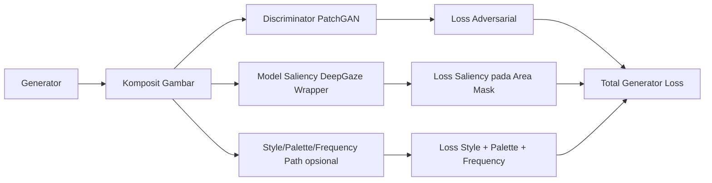

---

## 2. Metodologi Lengkap

## 2.1 Paradigma eksperimen

Metode yang digunakan adalah **GAN training dengan objective hybrid** dalam dua strategi eksperimen:

- Generator: memproduksi pattern untuk area target mask.
- Discriminator: menilai real image vs image komposit.
- Saliency model (frozen): menilai area yang berpotensi menarik perhatian.
- Run A (baseline): objective inti adversarial + saliency.
- Run B (advanced): objective Run A + style/palette/frequency + (opsional) curriculum sampling area mask.

### 2.2 Formula objective

Generator dioptimasi dengan:

$$
L_G = L_{adv} + \lambda_{sal} \cdot L_{sal} + \lambda_{style} \cdot L_{style} + \lambda_{palette} \cdot L_{palette} + \lambda_{freq} \cdot L_{freq}
$$

Dengan implementasi aktual:

- $L_{adv}$: `BCEWithLogitsLoss(D(fake_composite), 1)`
- $L_{sal}$: rata-rata saliency pada area mask, dinormalisasi luas mask
- $L_{style}$: deviasi statistik Gram multiscale terhadap style bank
- $L_{palette}$: jarak warna terhadap palet target metadata/dataset
- $L_{freq}$: jarak profil frekuensi radial terhadap referensi style
- $\lambda_{sal}$, $\lambda_{style}$, $\lambda_{palette}$, $\lambda_{freq}$: bobot loss pada config

Untuk baseline (Run A), loss opsional di-set 0 sehingga persamaan efektif kembali ke $L_G = L_{adv} + \lambda_{sal}L_{sal}$.

Discriminator:

$$
L_D = \frac{1}{2}(L_{real} + L_{fake})
$$

- $L_{real} = BCEWithLogitsLoss(D(real), 1)$
- $L_{fake} = BCEWithLogitsLoss(D(fake_{detach}), 0)$

### 2.3 Diagram metodologi end-to-end

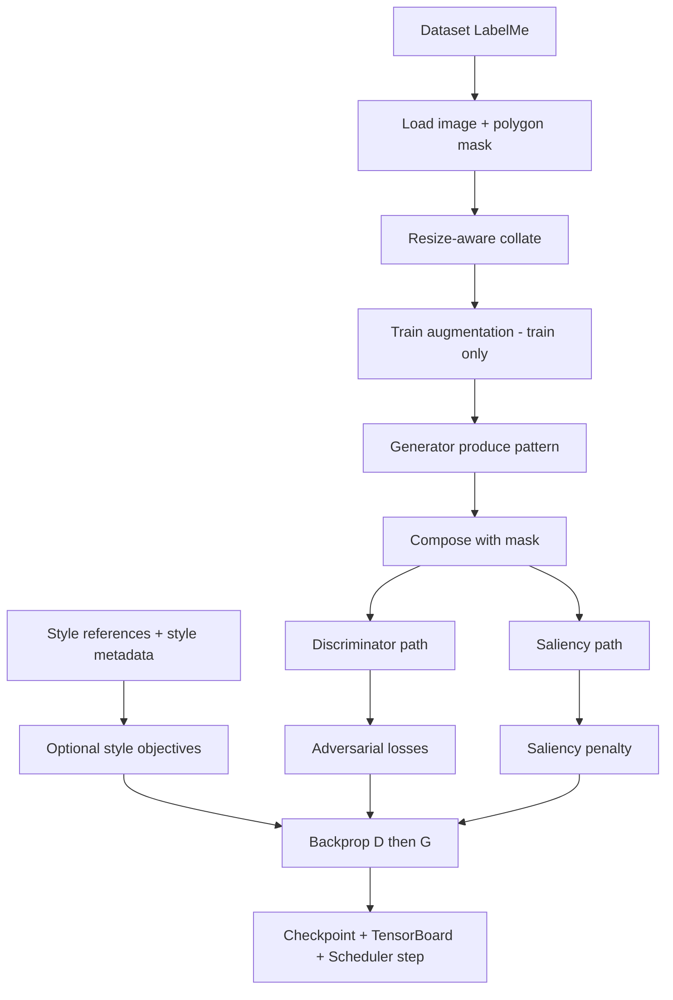

---

## 3. Arsitektur Sistem dan Modul

Berikut modul utama implementasi saat ini:

- `src/data/dataset_loader.py`
- `src/data/augmentations.py`
- `src/models/generator.py`
- `src/models/discriminator.py`
- `src/models/deepgaze_wrapper.py`
- `src/training/loss.py`
- `src/training/loss_style.py`
- `src/training/loss_palette.py`
- `src/training/loss_frequency.py`
- `src/training/curriculum.py`
- `src/training/trainer.py`
- `src/training/checkpoint.py`
- `src/training/scheduler.py`
- `src/training/tensorboard.py`
- `src/data/mask_area_sampler.py`
- `scripts/extract_style_metadata.py`
- `train.py`
- `config.yaml`
- `config.run_a.yaml`
- `config.run_b.yaml`

### 3.1 Diagram arsitektur komponen

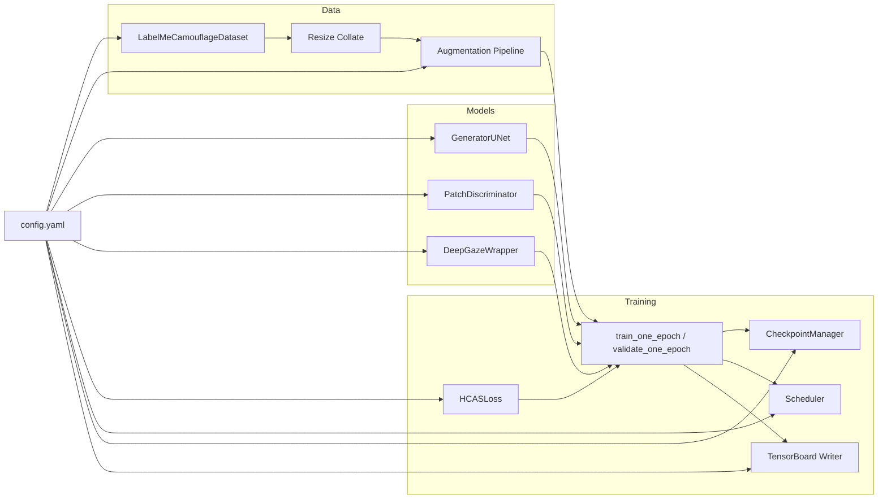

---

## 4. Alur Data, Input-Output, dan Percabangan Proses

## 4.1 Input data

Sumber input dari folder annotation (`config.data.annotations_dir`, default `./camo`).

Per sample:

- `*.json` LabelMe
- Pasangan gambar `*.png` (atau suffix config)

### 4.1.1 Kontrak input JSON (yang dipakai)

- `imagePath` (opsional, ada fallback robust)
- `shapes[]`
  - `label`
  - `shape_type` (harus `polygon`)
  - `points` (minimal 3 titik)

### 4.1.2 Percabangan saat parsing

- JSON strict gagal → parse relaxed (hapus trailing comma invalid).
- `imagePath` tidak valid → fallback ke nama file annotation + suffix.
- Label bukan target (`target_label`) atau masuk `ignore_labels` → di-skip.
- Sample malformed/invalid → di-skip saat indexing.

### 4.2 Output sample dataset

Dari `LabelMeCamouflageDataset.__getitem__`:

- `image`: `torch.Tensor [3,H,W]` float (`0..1` jika normalize aktif)
- `mask`: `torch.Tensor [1,H,W]` float biner (`0/1`)
- `image_path`: `str`
- `annotation_path`: `str`

### 4.3 Split dataset

`split_dataset()` melakukan split deterministik:

- train
- val
- test

Dengan seed reproducible (`experiment.seed`).

> Catatan implementasi saat ini di `train.py`: `val_ratio=0.1` dan `test_ratio=0.1` hardcoded di pemanggilan split.

### 4.4 Collate dan normalisasi ukuran

`build_resize_collate_fn(image_size, augmenter=None)`:

- Resize image: bilinear
- Resize mask: nearest
- Threshold mask `>0.5`
- Clamp image ke `[0,1]`
- Jika augmentasi membuat mask kosong, fallback ke mask sebelum augmentasi

### 4.5 Diagram dataflow I/O

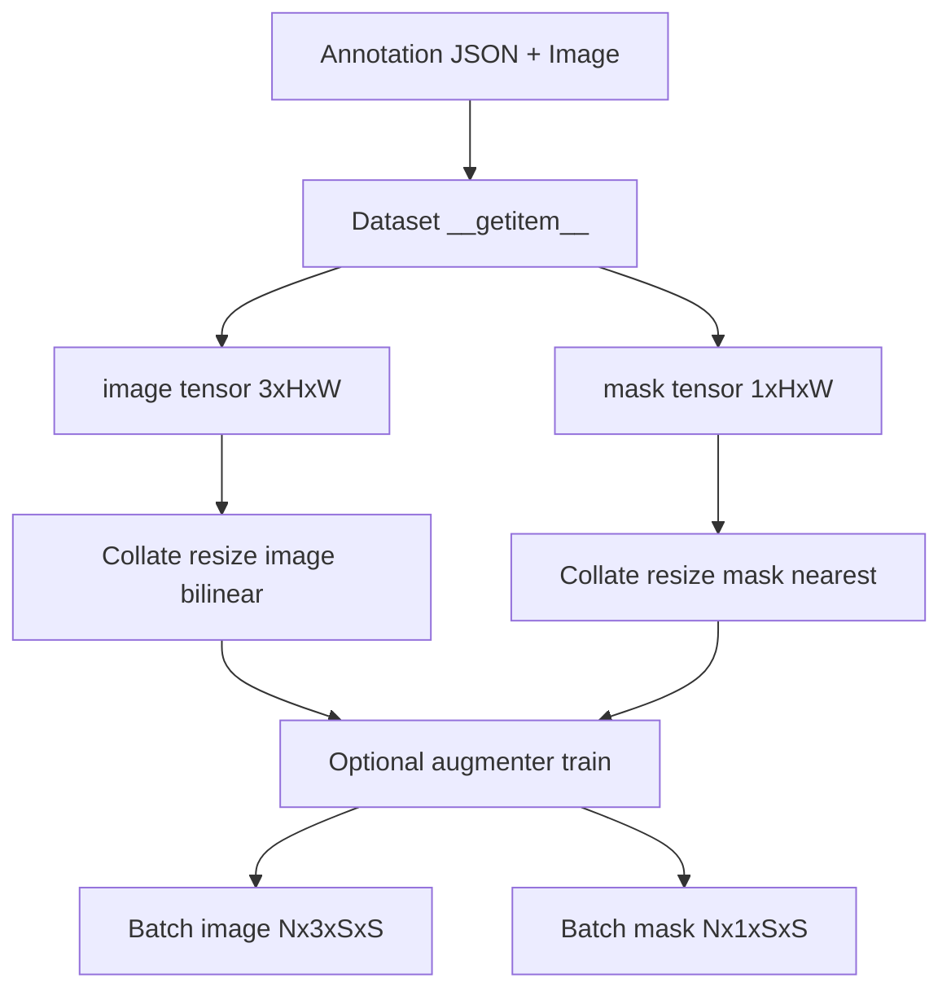

---

## 5. Augmentasi Data Lanjutan

Augmentasi dikerjakan oleh `CamouflageAugmentationPipeline`.

## 5.1 Prinsip desain

- Transform geometrik mask dilakukan aman (nearest + threshold biner).
- Transform fotometrik diterapkan pada image.
- Horizontal flip sinkron image/mask.
- Mask tidak boleh kosong setelah augmentasi.

## 5.2 Jenis augmentasi

- Random rotation mask (`max_rotation_deg`)
- Random scale mask (`mask_scale_range`)
- Random translation mask (`max_translate_ratio`)
- Horizontal flip (`hflip_prob`)
- Color jitter image (`brightness`, `contrast`, `saturation`, `hue`)

## 5.3 Schedule strength (warmup)

Jika `schedule_enabled=true`, strength dihitung linear:

$$
f(e) = f_{start} + (f_{end}-f_{start}) \cdot t
\quad,
\quad t=\text{clip}\left(\frac{e-1}{warmup-1}, 0, 1\right)
$$

Nilai ini menskalakan intensitas augmentasi per epoch.

### 5.4 Diagram augmentasi

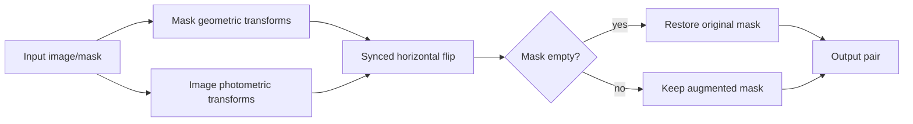

---

## 6. Arsitektur Model

## 6.1 Generator: U-Net

File: `src/models/generator.py`

Karakter:

- Encoder-decoder dengan skip-connections.
- 8 downsampling block, 7 upsampling block + final transpose conv.
- Norm: `InstanceNorm2d` (kecuali blok tertentu).
- Aktivasi output configurable (`sigmoid` default, opsi `tanh`).
- Inisialisasi conv normal $(\mu=0, \sigma=0.02)$.

### Penjelasan awam

Generator ini seperti “mesin desain tekstur” yang mempelajari konteks gambar lalu menempelkan pola baru hanya di area target.

### Penjelasan expert

Skip-connections menjaga detail spasial multi-skala dan mengurangi hilangnya informasi selama bottleneck, cocok untuk tugas image-to-image dengan ketelitian tepi.

### Diagram U-Net ringkas

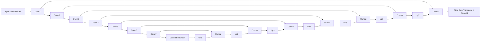

## 6.2 Discriminator: PatchGAN

File: `src/models/discriminator.py`

Karakter:

- Conv blocks bertingkat (`kernel=4`, kombinasi `stride=2` lalu `stride=1`).
- Output bukan 1 skalar, tapi **peta logit patch**.
- InstanceNorm + LeakyReLU.

Untuk input `256x256`, output patch map implementasi saat ini menjadi `30x30`.

### Penjelasan awam

Discriminator mengecek gambar seperti juri yang memeriksa “petak demi petak”, bukan hanya melihat sekali secara global.

### Diagram PatchGAN

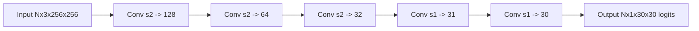

## 6.3 DeepGaze Wrapper

File: `src/models/deepgaze_wrapper.py`

Tujuan:

- Memakai backend real DeepGaze via `torch.hub` jika tersedia.
- Jika gagal, fallback ke backend proxy agar pipeline tetap jalan.
- Parameter model saliency di-freeze; gradien tetap bisa mengalir ke input image.

### 6.3.1 Mode backend

- `auto`
- `deepgazeiii_torchhub`
- `proxy`

### 6.3.2 Percabangan fallback

- Coba real backend jika `auto`/`deepgazeiii_torchhub`.
- Gagal load + fallback diizinkan → aktifkan `proxy`.
- Info backend tersimpan via `get_backend_info()`.

### 6.3.3 Kontrak input-output

Input: `image [N,3,H,W]`

Output: saliency map `[N,1,H,W]` (setelah formatting mode tertentu)

`output_mode`:

- `log_density`: raw
- `probability`: `exp(raw)`
- `density`: `exp(raw) * H * W`
- `sigmoid`: `sigmoid(raw)`

### 6.3.4 Diagram decision flow backend

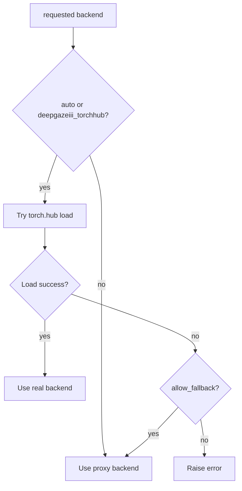

### 6.3.5 Diagram grad-flow pada saliency

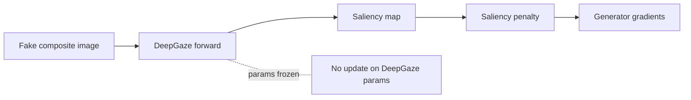

---

## 7. Logika Program Training

## 7.1 Orkestrasi di `train.py`

Urutan besar:

1. Parse args CLI
2. Load `config.yaml`
3. Set seed dan resolve device
4. Build dataset + split + dataloader
5. Build model (`GeneratorUNet`, `PatchDiscriminator`, `DeepGazeWrapper`)
6. Build loss (termasuk style/palette/frequency bila aktif) + optimizer
7. Build scheduler (opsional)
8. Build checkpoint manager
9. Build TensorBoard writer (opsional)
10. Resume checkpoint (opsional)
11. Loop epoch: train -> val -> scheduler step -> log (`g_style`,`g_palette`,`g_freq` bila aktif) -> save checkpoint periodik
12. Final test evaluate

### Diagram sequence orchestration

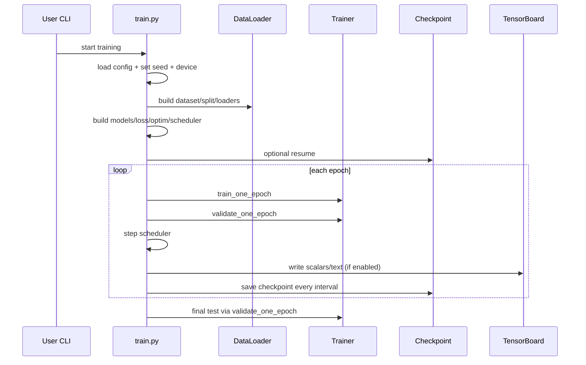

## 7.2 Detail `train_one_epoch`

Di `src/training/trainer.py`, urutan batch:

### D-step

- Enable grad untuk discriminator.
- Generate fake pattern dalam `torch.no_grad()`.
- Compose fake image + mask.
- Hitung `pred_real` dan `pred_fake`.
- Hitung `L_D`, backward, optimizer D step.

### G-step

- Disable grad discriminator.
- Generate fake pattern (dengan grad).
- Compose fake image.
- Hitung pred fake untuk G.
- Hitung saliency map dari saliency model.
- Resize saliency jika perlu ke ukuran mask.
- Hitung `L_G`, backward, optimizer G step.

### Diagram langkah per-batch

```mermaid
flowchart TD
    A[Batch image+mask] --> B[D-step]
    B --> B1[Generate fake no_grad]
    B1 --> B2[D(real), D(fake.detach)]
    B2 --> B3[Compute L_D]
    B3 --> B4[Backward + step optimizer D]
    B4 --> C[G-step]
    C --> C1[Freeze D grads]
    C1 --> C2[Generate fake with grad]
    C2 --> C3[D(fake), Saliency(fake)]
    C3 --> C4[Compute L_G]
    C4 --> C5[Backward + step optimizer G]
```

---

## 8. Input-Output Tiap Proses Utama

| Proses | Input | Output | Catatan |
|---|---|---|---|
| Dataset `__getitem__` | idx | `image[3,H,W]`, `mask[1,H,W]`, path strings | mask dari polygon LabelMe |
| Collate resize | list sample | batch `image[N,3,S,S]`, `mask[N,1,S,S]` | image bilinear, mask nearest |
| Augmentation | `image[3,S,S]`, `mask[1,S,S]` | pasangan tensor shape sama | train only |
| Generator | `image[N,3,S,S]` | `pattern[N,3,S,S]` | output aktivasi sigmoid/tanh |
| Compose | background + pattern + mask | `fake_composite[N,3,S,S]` | alpha blend berbasis mask |
| Discriminator | image/composite | logits patch map `[N,1,hp,wp]` | untuk S=256, hp=wp=30 |
| Saliency model | `fake_composite[N,3,S,S]` | saliency `[N,1,S,S]` (setelah format) | backend real/proxy |
| Loss generator | pred fake + saliency + mask (+ optional style refs/metadata) | `L_G`, `L_adv`, `L_sal`, `L_style`, `L_palette`, `L_freq` | objective hybrid v2 |
| Loss discriminator | pred real + pred fake | `L_D`, `L_real`, `L_fake` | rata-rata 0.5*(real+fake) |
| Checkpoint save | states + metadata | `.pt` checkpoint file | retain `keep_last_n` |
| Scheduler step | optimizer state | LR update | tipe step/cosine/lambda |
| TensorBoard write | metrics per epoch | event files | di `runs/<run_name>` |

### Diagram pipeline I/O

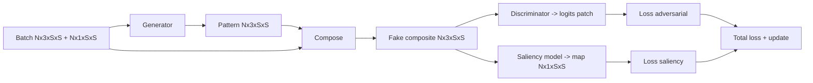

---

## 9. Checkpointing, Resume, dan Reproducibility

File: `src/training/checkpoint.py`

## 9.1 Apa yang disimpan

`CheckpointData` menyimpan:

- `epoch`, `step`
- `generator_state`, `discriminator_state`
- `optimizer_g_state`, `optimizer_d_state`
- `scheduler_g_state`, `scheduler_d_state` (opsional)
- `metadata` (opsional)

Format file:

- `checkpoint_epoch_{epoch:04d}_step_{step:06d}.pt`

## 9.2 Resume flow

Di `train.py`:

- `resume_from: null | "latest" | "path"`
- Jika `latest`, cari checkpoint terbaru di folder
- Jika load sukses, `start_epoch = last_epoch + 1`

### Diagram lifecycle checkpoint

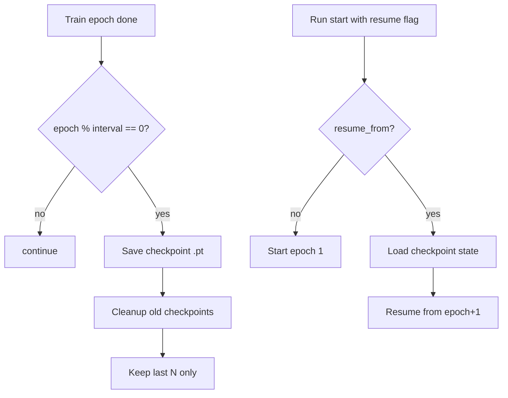

## 9.3 Reproducibility

- Seed di-set untuk Python random, NumPy, PyTorch, dan CUDA (jika ada).
- Konfigurasi terpusat di `config.yaml`.
- Resume mengembalikan optimizer/scheduler state untuk continuity training dynamics.

---

## 10. Learning Rate Scheduling

File: `src/training/scheduler.py`

Supported scheduler:

- `step` → `StepLR`
- `cosine` → `CosineAnnealingLR`
- `lambda` → `LambdaLR`

Jika mode `cosine` dan `t_max` tidak diisi, `train.py` mengisi otomatis dengan total epochs.

### Diagram percabangan scheduler

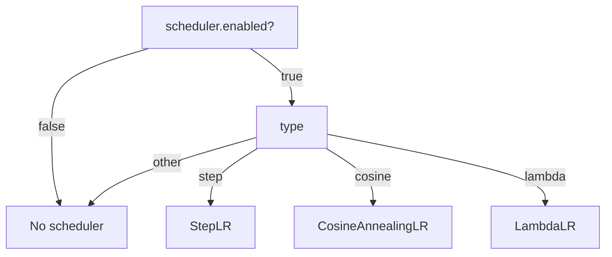

### Ringkas awam

Scheduler itu seperti “menurunkan kecepatan belajar bertahap” supaya awal agresif, akhir lebih halus.

### Ringkas expert

API scheduler dibangun lewat factory `build_scheduler(optimizer, scheduler_type, **kwargs)` dan distandardisasi via helper `step_scheduler()` serta `get_learning_rate()`.

---

## 11. TensorBoard Logging

File: `src/training/tensorboard.py`

`build_summary_writer()` akan:

- Mengembalikan `None` jika disabled atau dependency unavailable.
- Membuat log directory `log_dir/run_name` jika aktif.

Di `train.py`, metrik utama yang dicatat per epoch:

- Train/Val: `g_total`, `d_total`, `g_adv`, `g_sal`
- Train/Val tambahan (bila aktif): `g_style`, `g_palette`, `g_freq`
- LR `g` dan `d`
- Augmentation strength (jika ada)
- Sampling ratio kecil/sedang/besar (jika mask area curriculum sampler aktif)
- Timing train/val
- Final test scalar

### Diagram logging flow

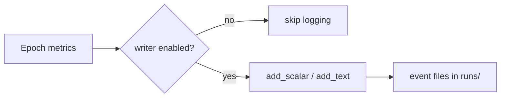

---

## 12. Konfigurasi Eksperimen (`config.yaml`, `config.run_a.yaml`, `config.run_b.yaml`)

## 12.1 Parameter inti

- `experiment`: nama eksperimen, seed
- `hardware`: device, num_workers
- `data`: path + format annotation + label target
- `hyperparameters`: LR, beta, batch size, epochs
- `checkpoint`: dir, interval, keep_last_n, resume_from
- `scheduler`: enabled, type, kwargs
- `tensorboard`: enabled, log_dir, run_name, flush_secs
- `hcas_specific`: `lambda_sal`, `image_size`
- `style_prior`: enable, bobot style loss, style bank source
- `palette`: enable, bobot palette loss, path metadata JSON / dataset fallback
- `frequency`: enable, bobot frequency loss, n_bins
- `sampling.mask_area_curriculum`: kurikulum sampling area mask (small/medium/large)
- `saliency_model`: backend strategy + mode output
- `augmentations`: seluruh setelan augmentasi + schedule

Catatan penting v2:

- Run B membutuhkan metadata style terbaru (`scripts/extract_style_metadata.py`).
- Pastikan `palette.palette_json_path` mengarah ke metadata yang benar, misalnya `./camo/style_metadata/style_metadata.json`.

## 12.2 Prioritas konfigurasi

1. CLI override
2. `config.yaml`
3. default value di kode

### Diagram prioritas

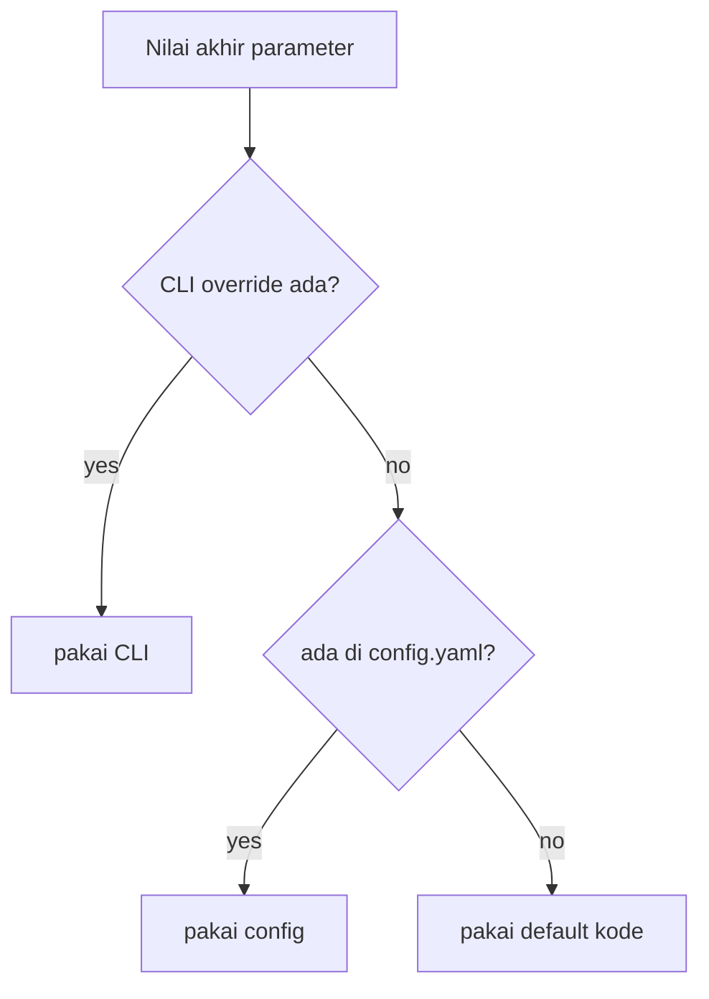

---

## 13. Proses Percabangan Kritis (Decision Points)

## 13.1 Percabangan data

- JSON invalid → parse relaxed
- Sample rusak → skip indexing
- Mask kosong setelah augmentasi → rollback mask original

## 13.2 Percabangan runtime

- Device `cuda` tersedia? jika tidak, fallback `cpu`
- Scheduler enabled? jika tidak, tidak ada step LR
- TensorBoard enabled/dependency ada? jika tidak, nonaktif aman
- Resume checkpoint? jika gagal load, lanjut start from scratch

## 13.3 Percabangan saliency backend

- `auto`: coba real, fallback proxy
- `deepgazeiii_torchhub`: paksa real (kecuali allow_fallback true)
- `proxy`: langsung model ringan fallback

### Diagram decision tree runtime

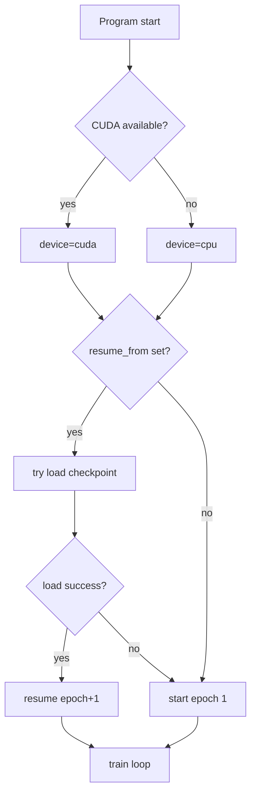

---

## 14. Kondisi Saat Ini: Yang Sudah Bisa dan Belum

## 14.1 Sudah bisa

- End-to-end training loop GAN + saliency + optional style/palette/frequency losses.
- Data loading LabelMe robust untuk kasus umum dataset ini.
- Resize-aware batching untuk resolusi campuran.
- Augmentasi sinkron image/mask dengan schedule intensitas.
- DeepGaze wrapper real + fallback proxy.
- Ekstraksi style metadata otomatis via `scripts/extract_style_metadata.py`.
- Logging metrik tambahan (`g_style`, `g_palette`, `g_freq`) untuk eksperimen advanced.
- Checkpoint save/load/resume + retention.
- Scheduler config-driven.
- TensorBoard logging terintegrasi.
- Sanity checks untuk komponen inti.
- Visual inference dari checkpoint untuk perbandingan `environment | mask | generated pattern | composite`.
- Ekspor pattern hasil generate dalam bentuk gambar flat 1x1 per sample untuk inspeksi motif.

## 14.2 Belum/parsial

- Metrik evaluasi lanjutan (`metrics_ssim.py`, `metrics_lpips.py`) belum menjadi pipeline evaluasi final produksi.
- Belum ada modul deployment/inference API terpisah untuk serving.
- Belum ada benchmark kuantitatif final yang dibakukan di dokumen ini.

---

## 15. Panduan Baca untuk Awam vs Expert

## 15.1 Jika Anda pembaca awam

Fokus dulu ke:

1. Bagian 1 (tujuan)
2. Bagian 2 (metodologi ringkas)
3. Bagian 4 (alur data)
4. Bagian 7 (alur training)

Lalu lihat diagram; itu sudah cukup untuk memahami cara kerja sistem secara konseptual.

## 15.2 Jika Anda pembaca expert

Fokus ke:

1. Bagian 5 (arsitektur model)
2. Bagian 6-8 (logika training + kontrak I/O)
3. Bagian 9-12 (ops/repro/config)
4. Bagian 13 (decision points)
5. Bagian 17 (hasil evaluasi visual checkpoint)

---

## 16. Lampiran: Peta File dan Peran

| File | Peran |
|---|---|
| `train.py` | Orkestrasi eksperimen end-to-end |
| `config.yaml` | Sumber konfigurasi utama |
| `src/data/dataset_loader.py` | Parsing LabelMe, mask rasterization, split, collate resize-aware |
| `src/data/augmentations.py` | Augmentasi train-time sinkron image/mask + schedule |
| `src/models/generator.py` | U-Net generator |
| `src/models/discriminator.py` | PatchGAN discriminator |
| `src/models/deepgaze_wrapper.py` | Integrasi saliency backend real/fallback |
| `src/training/loss.py` | HCAS loss komposit (adv + saliency + optional style/palette/frequency) |
| `src/training/loss_style.py` | Style prior loss berbasis Gram multiscale |
| `src/training/loss_palette.py` | Palette-constrained loss |
| `src/training/loss_frequency.py` | Frequency profile matching loss |
| `src/training/curriculum.py` | Scheduler lambda/curriculum training |
| `src/training/trainer.py` | Train/val loops dan aggregasi metrics |
| `src/training/checkpoint.py` | Save/load checkpoint + keep-last-n |
| `src/training/scheduler.py` | Factory scheduler + helper LR |
| `src/training/tensorboard.py` | Utility writer TensorBoard |
| `src/data/mask_area_sampler.py` | Sampler curriculum berdasarkan area mask |
| `scripts/extract_style_metadata.py` | Ekstraksi metadata style references (JSON + CSV) |
| `scripts/run_visual_inference.py` | Inference visual dari checkpoint + ekspor pattern flat 1x1 |
| `inference_outputs/<checkpoint_name>/` | Artefak evaluasi visual dan pattern flat hasil inferensi |

---

## 17. Update Eksperimen Terbaru: Evaluasi Visual Checkpoint Final

### 17.1 Konteks run

- Checkpoint evaluasi: `checkpoints/checkpoint_epoch_1000_step_016000.pt`
- Split evaluasi visual: `test`
- Jumlah sample target: 6
- Device inferensi: CPU (kompatibel juga untuk CUDA/auto)

### 17.2 Artefak yang dihasilkan

Lokasi output:

- `inference_outputs/checkpoint_epoch_1000_step_016000/`

File utama:

- `visual_comparison_6samples.png` → panel perbandingan **Environment | Mask | Generated Pattern | Composite**.
- `pattern_flat_1x1_sample01.png` → flat pattern 1x1 sample pertama.
- `pattern_flat_1x1_sample02.png` s.d. `pattern_flat_1x1_sample06.png` → flat pattern 1x1 sample lainnya.

### 17.3 Catatan kualitas data saat inferensi

Pada eksekusi evaluasi visual ditemukan sebagian kecil file image dataset tidak dapat dibaca OpenCV (contoh nama file dengan karakter khusus seperti simbol `™`).

Mitigasi yang diterapkan di script inference:

- sample bermasalah di-skip otomatis,
- inferensi tetap berjalan untuk sample yang valid,
- jumlah sample sukses vs skipped dicetak pada log run.

### 17.4 Nilai praktis untuk eksperimen

Tambahan pipeline ini memungkinkan evaluasi cepat terhadap:

- kualitas blending pattern terhadap lingkungan,
- konsistensi bentuk/tekstur pattern di area target,
- pemilihan checkpoint kandidat terbaik berbasis inspeksi visual.

---

## 18. Penutup

HCAS-GAN pada repository ini sudah mencapai baseline teknis yang solid untuk eksperimen kamuflase berbasis anti-saliency:

- objective hybrid berjalan,
- pipeline data stabil,
- komponen training modern (checkpoint/scheduler/logging) sudah terpasang,
- evaluasi visual checkpoint + ekspor pattern flat sudah tersedia.

Langkah berikutnya yang direkomendasikan adalah standardisasi evaluasi kuantitatif dan penyiapan protokol benchmark agar hasil eksperimen antar-run makin mudah dibandingkan.

> Dokumen ini ditulis sesuai implementasi aktual codebase per Maret 2026.

---

## 19. Strategi Eksperimen v2 Terbaru (Pra-Run B di VAST AI)

Bagian ini merangkum strategi operasional terbaru sebelum memulai Run B di GPU rental.

### 19.1 Definisi run

- **Run A (Baseline):** objective inti (`L_adv + \lambda_{sal}L_sal`), digunakan sebagai pembanding utama.
- **Run B (Advanced):** Run A + style/palette/frequency losses, dengan konfigurasi `config.run_b.yaml`.

### 19.2 Prasyarat wajib Run B

1. Folder style references sudah rapi (flat folder diperbolehkan): `camo/style_reference_clean/`.
2. Jalankan ekstraksi metadata style:

    ```bash
    python scripts/extract_style_metadata.py --input-dir camo/style_reference_clean --output-dir camo/style_metadata
    ```

3. Verifikasi file output ada:
    - `camo/style_metadata/style_metadata.json`
    - `camo/style_metadata/style_domain_map.csv`
4. Sinkronkan `palette_json_path` di `config.run_b.yaml` ke metadata terbaru.

### 19.3 Urutan eksekusi yang direkomendasikan

1. Jalankan **Run A** sampai stabil (target utama: baseline pembanding).
2. Jalankan **Run B dari fresh start** untuk evaluasi adil antar-metode.
3. Bandingkan checkpoint terbaik Run A vs Run B berdasarkan:
    - visual blending,
    - stabilitas loss validasi,
    - metrik saliency,
    - (opsional) metrik perceptual/SSIM/LPIPS.

### 19.4 Catatan praktis VAST AI

- Gunakan `tmux` agar training tidak berhenti saat SSH putus.
- Simpan checkpoint/log per run di direktori terpisah (`checkpoints_runA`, `checkpoints_runB`, `runs_runA`, `runs_runB`).
- Lakukan sanity check dan smoke test sebelum long-run untuk menghindari pemborosan biaya GPU.
